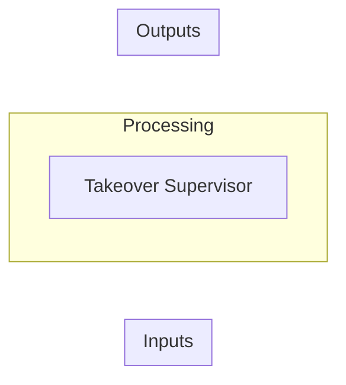

# Takeover Supervisor

Lightweight human-in-the-loop supervisor for Hermes and other AI agents.

---

## Overview

# Takeover Supervisor

Lightweight human-in-the-loop supervisor for Hermes and other AI agents. When your
agent hits a CAPTCHA, bot-detection puzzle, or login wall:

1. Agent touches `/tmp/takeover/stuck` and describes the page to you in chat
2. Supervisor sends you a Telegram ping (so you notice even if you're away)
3. You respond in chat with instructions ("click the checkbox", "type X in the field")
4. Agent executes your instructions, then touches `/tmp/takeover/resume`
5. Supervisor resets and goes back to watching

No VNC, no display server, no browser — just a file-based signal protocol and a
Telegram ping. The agent owns the browser and describes what it sees; you give
instructions in plain text.

## How It Works

```
Agent hits puzzle → describes page in chat → touches /tmp/takeover/stuck
                                                         ↓
Supervisor detects stuck → pings you on Telegram → you check chat
                                                         ↓
You give instructions → agent executes → touches /tmp/takeover/resume
                                                         ↓
Supervisor detects resume → agent continues
```

The supervisor only owns two things: watching for the stuck signal and sending
the Telegram notification. Everything else — the browser, the page description,
the instruction-following — is handled by the agent.

## Prerequisites

- Python 3.8+
- A Telegram bot token (from [@BotFather](https://t.me/BotFather))
- Your Telegram chat ID

## Quick Start

```bash
# 1. Clone
git clone https://github.com/joewpb/takeover-supervisor.git
cd takeover-supervisor

# 2. Install dep
pip install requests

# 3. Set secrets
export TELEGRAM_TOKEN="your-bot-token"
export TELEGRAM_CHAT="your-telegram-user-id"

# 4. Launch (runs forever, watching for the stuck signal)
python3 supervisor.py
```

## Agent Integration

Three lines in any browser-automation framework:

```python
from pathlib import Path
import time

def handle_roadblock(driver, agent_chat):
    """Call this when the agent detects a CAPTCHA or bot wall."""
    agent_chat.send("I'm stuck on a CAPTCHA. Page has a checkbox and a 'Verify' button.")
    Path("/tmp/takeover/stuck").touch()         # Signal the supervisor
    while Path("/tmp/takeover/stuck").exists():  # Block until human solves it
        time.sleep(1)
    # Human gave instructions via chat, agent executed them, resume was touched
```

That's it. No display server, no VNC, no browser running in the supervisor.

## Architecture

```
┌──────────────┐     /tmp/takeover/stuck      ┌──────────────┐
│  Your Agent  │ ────────────────────────────→ │  Supervisor  │
│ (Playwright, │                               │ (this script)│
│  Puppeteer,  │ ←─── /tmp/takeover/resume ─── │              │
│  Selenium)   │                               │  Telegram    │
│              │                               │  ping        │
│   Browser    │                               └──────┬───────┘
│   + page     │                                      │
│   description│                               ┌──────┴───────┐
└──────┬───────┘                               │  Your Phone  │
       │                                       │  (Telegram)  │
       │  Chat: "I see a checkbox..."          └──────────────┘
       │  You:    "Click it, then Verify"
       ↓
   Instructions → agent executes → resume signal
```

## Agent Prompt Template

Add this to your Hermes prompt to handle takeovers automatically:

```
When you encounter a CAPTCHA or bot-detection page:
1. Describe what you see on the page to the user
2. Touch /tmp/takeover/stuck
3. Wait for the user's instructions, then execute them
4. Touch /tmp/takeover/resume and continue
```

## Configuration

| Variable | Default | Description |
|----------|---------|-------------|
| `TELEGRAM_TOKEN` | (env) | Telegram bot token |
| `TELEGRAM_CHAT` | (env) | Telegram user/chat ID |

## How To Get Your Telegram Chat ID

1. Send any message to your bot
2. Visit: `https://api.telegram.org/bot<TOKEN>/getUpdates`
3. Find `"chat":{"id":7482279278}` — that's your chat ID

## License

MIT


---

## Architecture

### Inputs

### Outputs

### Dependencies
_None specified_

### Data Flow




---

## Code References

_None provided_

---

## Provenance

| Field | Value |
|-------|-------|
| Hermes Run ID | discovery |
| Payload Hash | 93e61ba347b61c54bfdd31f2611a74c0c08ebabbef86055f0a2412fc2c2419f6 |
| Source Path | /home/hermes/workspace/takeover-supervisor |
| Published At | 2026-09-06T10:45:43Z |
| Kind | project |
| Destination | existing_repo |